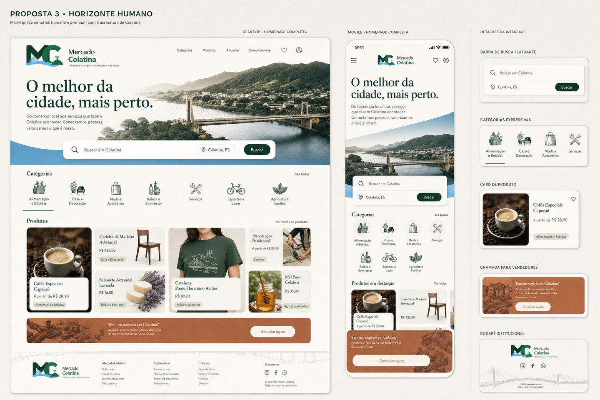
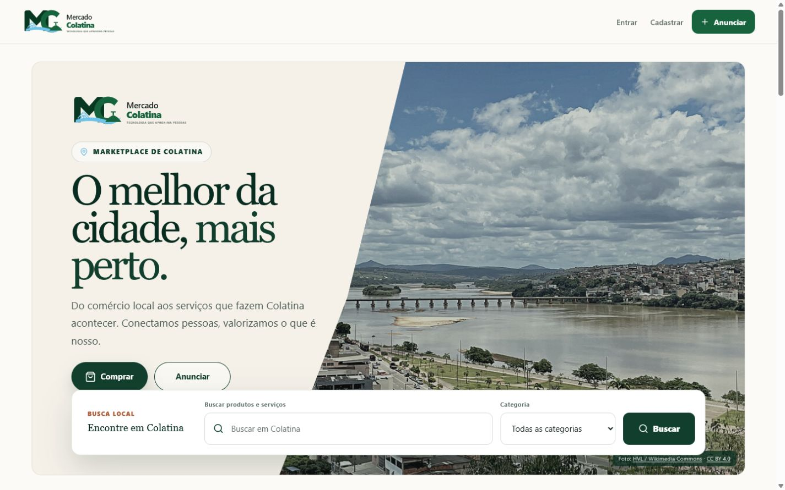

# RELATÓRIO OS-012 — HOME OFICIAL

**Projeto:** Mercado Colatina

**Direção aprovada:** Proposta 3 — Horizonte Humano

**Data da validação:** 14 de julho de 2026

**Status:** implementação concluída e preparada para auditoria em Pull Request Draft

## 1. Resultado

A Home foi redesenhada exclusivamente na camada de experiência visual, reproduzindo a direção aprovada “Horizonte Humano”: composição editorial, fotografia panorâmica real de Colatina, busca protagonista, identidade local valorizada, categorias expressivas, vitrine assimétrica, chamada ao vendedor em terracota e rodapé institucional claro.

Não houve merge nem deploy nesta ordem de serviço.

## 2. Comparação com a proposta aprovada

| Elemento aprovado | Implementação |
| --- | --- |
| Hero editorial e humano | Composição assimétrica em marfim, tipografia editorial e título “O melhor da cidade, mais perto.” |
| Logo MC valorizada | Logo presente no cabeçalho e em destaque dentro do hero, preservando ponte e Cristo |
| Panorama de Colatina | Fotografia real do Rio Doce, cidade e Ponte Florentino Avidos, com recorte panorâmico responsivo |
| Busca protagonista | Faixa branca elevada sobre a fotografia, ampla, central e visível no primeiro quadro em todos os breakpoints validados |
| Categorias com forte leitura | Grade linear com dez ícones consistentes, estado ativo e reorganização para tablet e celular |
| Cards editoriais | Fotografias maiores, composição assimétrica no desktop, preço com hierarquia e leitura integral no celular |
| Chamada ao vendedor | Bloco terracota com mensagem local, CTA “Anunciar agora” e benefício do plano gratuito preservado |
| Rodapé institucional | Estrutura clara em quatro áreas, assinatura da Edição Fundadora e linha gráfica inspirada na ponte |

### Proposta 3 aprovada

### Implementação desktop — 1440 px

### Implementação mobile — 390 px

## 3. Fotografia e atribuição

A fotografia panorâmica é uma vista real de Colatina, de autoria de HVL, disponibilizada no Wikimedia Commons sob licença CC BY 4.0. A atribuição e o link para a licença permanecem visíveis no próprio hero.

- Fonte: <https://commons.wikimedia.org/wiki/File:Vista_parcial_de_Colatina_ES.JPG>
- Licença: <https://creativecommons.org/licenses/by/4.0/>

## 4. Validação visual e responsiva

| Largura | Resultado |
| ---: | --- |
| 320 px | aprovado, sem rolagem horizontal |
| 360 px | aprovado, sem rolagem horizontal |
| 390 px | aprovado, sem rolagem horizontal |
| 768 px | aprovado, sem rolagem horizontal |
| 1024 px | aprovado, sem rolagem horizontal |
| 1440 px | aprovado, sem rolagem horizontal |

Em todas as larguras foram confirmados: um único título principal, busca visível no primeiro quadro, imagens carregadas, cards ocupando corretamente a largura disponível e ausência de conflito visual. A navegação local respondeu com HTTP 200 e o console do navegador permaneceu sem erros ou avisos.

## 5. Qualidade automatizada

- Suíte completa: **88 testes aprovados**.
- Ruff: **aprovado, sem ocorrências**.
- Formatação Ruff: **8 arquivos verificados, todos formatados**.
- Verificação de diferenças do Git: **sem erros de whitespace**.
- Auditoria das variáveis visuais da OS-012: **nenhuma variável indefinida**.

## 6. Arquivos alterados

- `templates/index.html` — composição visual oficial da Home, sem alteração de rotas ou regras.
- `static/styles.css` — sistema visual responsivo “Horizonte Humano”.
- `static/colatina-rio-doce-panorama-hvl.jpg` — fotografia panorâmica licenciada.
- `tests/test_moderacao.py` — atualização dos contratos visuais da Home.
- `docs/evidencias/os012-proposta-3-aprovada.jpg` — referência aprovada.
- `docs/evidencias/os012-home-desktop.jpg` — evidência desktop.
- `docs/evidencias/os012-home-mobile.jpg` — evidência mobile.
- `RELATORIO_OS_012_HOME_OFICIAL.md` — este relatório.

## 7. Preservação das regras de negócio

Foram preservados integralmente banco de dados, models, migrations, autenticação, pedidos, estoque, reputação, permissões, APIs, rotas e regras de negócio. Nenhum arquivo de aplicação, persistência ou migração foi alterado. Os formulários mantêm os mesmos métodos, nomes de campos, destinos e condicionais de autenticação existentes.

## 8. Conclusão

A implementação reproduz claramente a Proposta 3 — Horizonte Humano e está pronta para avaliação do fundador em Pull Request Draft. A Home oficial mantém a identidade local do Mercado Colatina com acabamento premium, humano e atemporal, sem neon, cyberpunk, excesso de efeitos ou reinterpretação do conceito aprovado.
